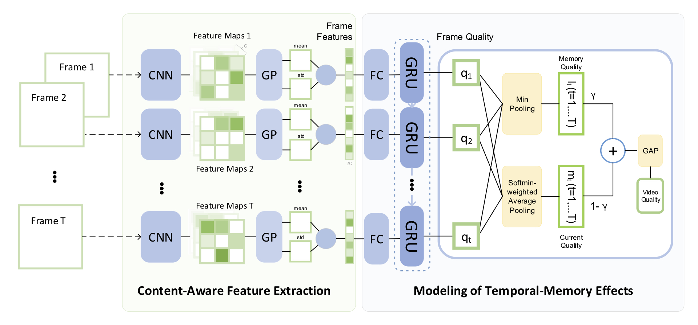

# Quality Assessment of In-the-Wild Videos
[](License)

## Description
VSFA code for the following papers:

- Dingquan Li, Tingting Jiang, and Ming Jiang. [Quality Assessment of In-the-Wild Videos](https://dl.acm.org/citation.cfm?doid=3343031.3351028). In Proceedings of the 27th ACM International Conference on Multimedia (MM ’19), October 21-25, 2019, Nice, France. [[arxiv version]](https://arxiv.org/abs/1908.00375)


### Intra-Database Experiments (Training and Evaluating)
#### Feature extraction

```
CUDA_VISIBLE_DEVICES=0 python CNNfeatures.py --database=KoNViD-1k --frame_batch_size=64
```

You need to specify the `database` and change the corresponding `videos_dir`.

#### Quality prediction

```
CUDA_VISIBLE_DEVICES=0 python VSFA.py --database=KoNViD-1k --exp_id=0
```

You need to specify the `database` and `exp_id`.

#### Visualization
```bash
tensorboard --logdir=logs --port=6006 # in the server (host:port)
ssh -p port -L 6006:localhost:6006 user@host # in your PC. See the visualization in your PC
```

#### Reproduced results
We set seeds for the random generators and re-run the experiments on the same ten splits.
(The results may be still not the same among different version of PyTorch. See [randomness@Pytorch Docs](https://pytorch.org/docs/stable/notes/randomness.html))

The reproduced overall results are better than the previous results published in the paper.
We add learning rate scheduling in the updated code.
Better hyper-parameters may be set, if you "look" at the training loss curve and the curves of validation results.

The mean (std) values of the first ten index splits (60%:20%:20% train:val:test)

|       | KoNViD-1k | CVD2014 | LIVE-Qualcomm |
| ----  |    ----   |   ----  |      ----     |
| SROCC | 0.7728 (0.0189) | 0.8698 (0.0368) | 0.7726 (0.0611) |
| KROCC | 0.5784 (0.0194) | 0.6950 (0.0465) | 0.5871 (0.0620) | 
| PLCC  | 0.7754 (0.0192) | 0.8678 (0.0315) | 0.7954 (0.0553) |
| RMSE  | 0.4205 (0.0211) | 10.8572 (1.3518)| 7.5495 (0.7017) |

### Test Demo

The model weights provided in `models/VSFA.pt` are the saved weights when running the 9-th split of KoNViD-1k.
```
python test_demo.py --video_path=test.mp4
```

### Requirement
```bash
conda create -n reproducibleresearch pip python=3.6
source activate reproducibleresearch
pip install -r requirements.txt -i https://pypi.tuna.tsinghua.edu.cn/simple
source deactive
```
- PyTorch 1.1.0
- TensorboardX 1.2, TensorFlow-TensorBoard

Note: The codes can also be directly run on PyTorch 1.3.

### Contact
Dingquan Li, dingquanli AT pku DOT edu DOT cn.